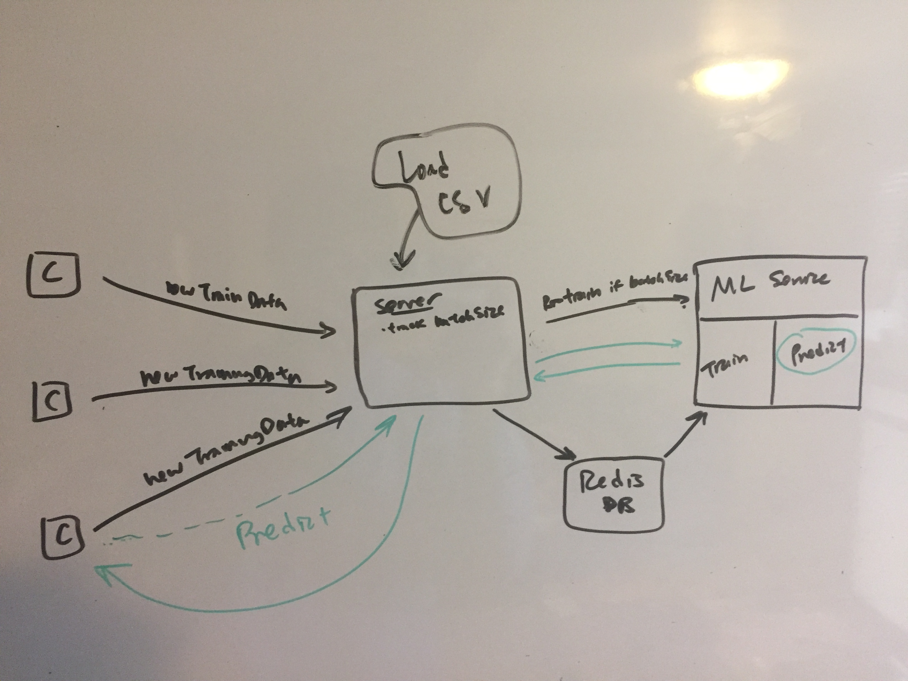

## Learning project for Predicting Heart Disease

Practice with:
* Docker
* Redis
* Machine Learning (binary classification) in Golang

[Link to dataset source](https://www.kaggle.com/ronitf/heart-disease-uci)

### Planning app structure:

