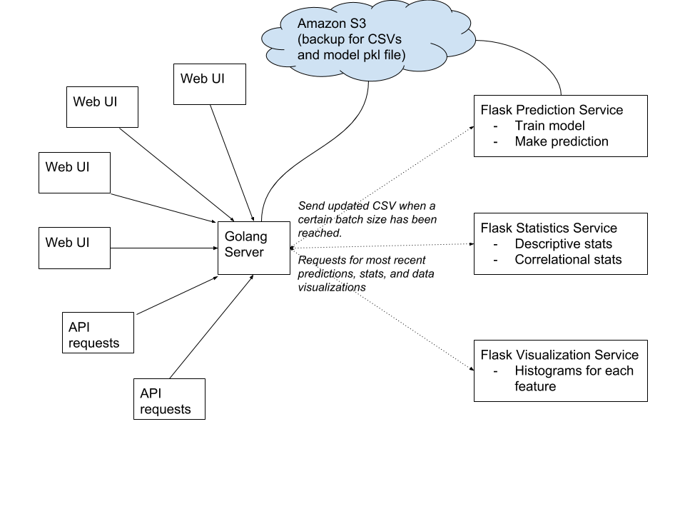

## Learning project for Predicting Heart Disease

[Link to dataset source](https://www.kaggle.com/ronitf/heart-disease-uci)

Planning application architecture: 

# Setup

1. Make sure to have Docker installed
2. Clone repository
3. Run `docker-compose build`
4. Run `docker-compose up`
5. Open `http://localhost:8000` to see user interface

